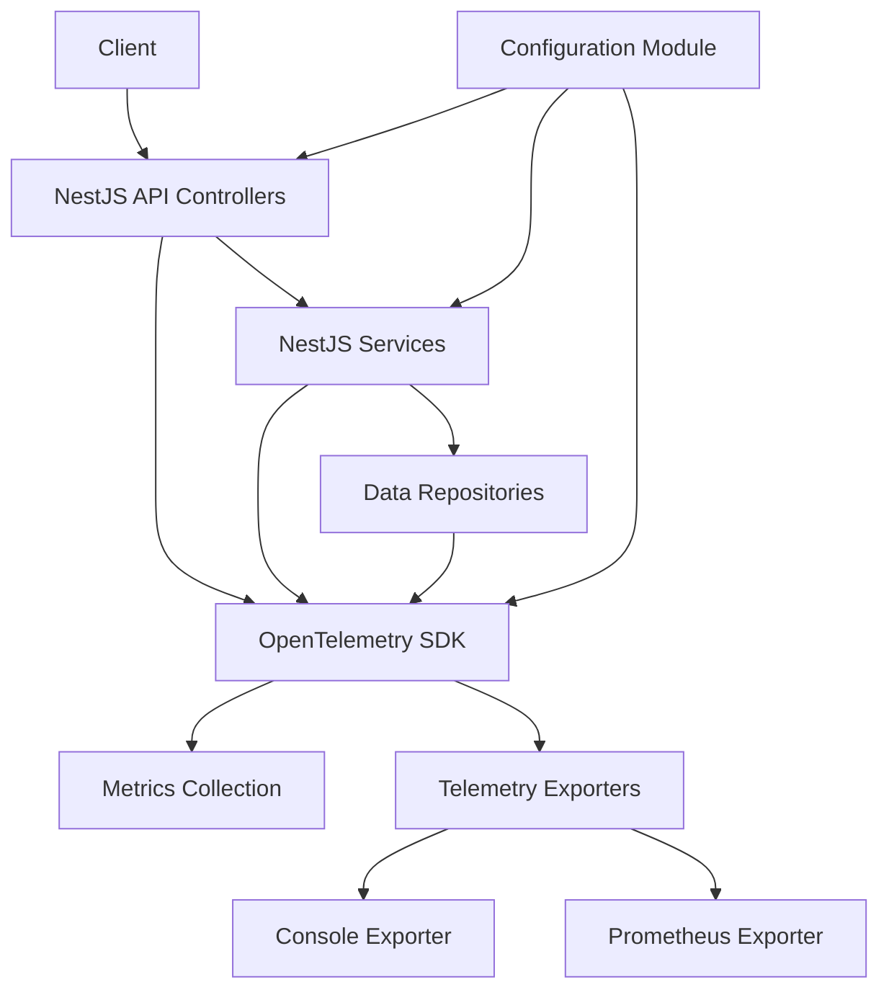
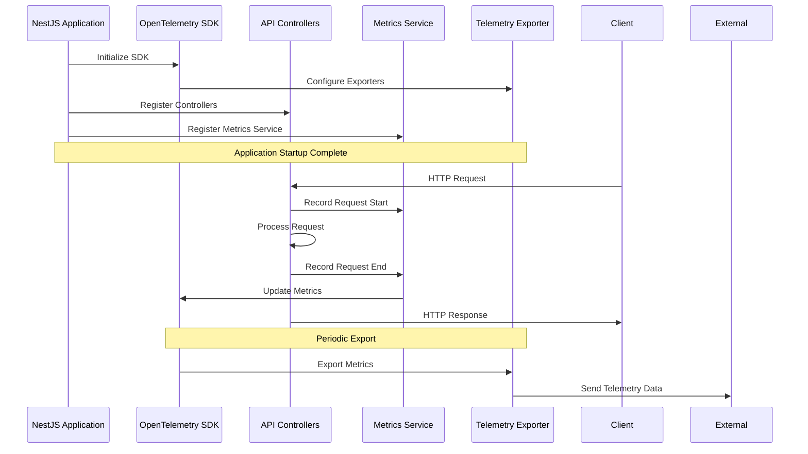

# Design Document: NestJS OpenTelemetry POC

> **Document Information**  
> Created by: Claude 3 Opus (Anthropic)  
> Date: 19/07/2025  
> Version: 1.0  

## Overview

This document outlines the design for a proof of concept (POC) application that demonstrates how OpenTelemetry can be used to instrument a NestJS API. The focus is on implementing counters and metrics to monitor application performance and behaviour.

The design adheres to the following rules:

- British English spelling throughout all code and documentation
- Code comments that explain why decisions were made, not what the code does
- Minimisation of external libraries and frameworks beyond NestJS and OpenTelemetry
- Maintenance of a RATIONALE.md file to document design decisions, assumptions, and insights
- Clear indication of AI/LLM version information in all documentation

These principles will guide all implementation decisions and documentation practices throughout the project.

## Architecture

The application will follow a modular architecture based on NestJS principles, with OpenTelemetry integrated as a cross-cutting concern. The architecture consists of the following main components:



### Key Components

1. **NestJS Application Core**:
   - Controllers: Handle HTTP requests and define API endpoints
   - Services: Implement business logic
   - Repositories: Handle data access (simulated for this POC)

2. **OpenTelemetry Integration**:
   - SDK Configuration: Set up and initialise the OpenTelemetry SDK
   - Instrumentation: Automatic and manual instrumentation of application code
   - Metrics Collection: Define and collect custom metrics and counters
   - Exporters: Export telemetry data to various backends

3. **Configuration**:
   - Environment-based configuration for OpenTelemetry
   - Configurable exporters and metric options

## Components and Interfaces

### 1. OpenTelemetry Module

The OpenTelemetry module will be responsible for initialising and configuring the OpenTelemetry SDK. It will be implemented as a NestJS dynamic module that can be imported into the application.

```typescript
// Simplified interface for the OpenTelemetry module
interface OpenTelemetryModuleOptions {
  serviceName: string;
  serviceVersion?: string;
  environment?: string;
  exporters: {
    console?: boolean;
    prometheus?: {
      endpoint?: string;
      port?: number;
    };
  };
  metrics: {
    hostMetrics?: boolean;
    apiMetrics?: boolean;
  };
}
```

### 2. Metrics Service

The Metrics Service will provide an abstraction over the OpenTelemetry metrics API, making it easier to create and update metrics from within the application.

```typescript
// Simplified interface for the Metrics Service
interface MetricsService {
  createCounter(name: string, description: string): Counter;
  createUpDownCounter(name: string, description: string): UpDownCounter;
  createHistogram(name: string, description: string): Histogram;
  recordApiCall(endpoint: string, method: string, params: Record<string, any>, durationMs: number): void;
}

interface Counter {
  add(value: number, attributes?: Record<string, any>): void;
}

interface UpDownCounter {
  add(value: number, attributes?: Record<string, any>): void;
}

interface Histogram {
  record(value: number, attributes?: Record<string, any>): void;
}
```

### 3. API Controllers

The API will consist of several controllers to demonstrate different types of operations and their instrumentation:

```typescript
// Example controller interfaces
interface ProductsController {
  findAll(query: QueryParameters): Promise<Product[]>;
  findOne(id: string): Promise<Product>;
  create(createProductDto: CreateProductDto): Promise<Product>;
  update(id: string, updateProductDto: UpdateProductDto): Promise<Product>;
  remove(id: string): Promise<void>;
}

interface OrdersController {
  findAll(query: QueryParameters): Promise<Order[]>;
  findOne(id: string): Promise<Order>;
  create(createOrderDto: CreateOrderDto): Promise<Order>;
  process(id: string): Promise<Order>;
}

interface HealthController {
  check(): Promise<HealthStatus>;
}
```

### 4. Interceptors and Middleware

To automatically capture metrics for all API calls, we will implement NestJS interceptors and middleware:

```typescript
// Simplified interface for the metrics interceptor
interface MetricsInterceptor {
  intercept(context: ExecutionContext, next: CallHandler): Observable<any>;
}
```

## Data Models

### 1. API Data Models

For the purpose of this POC, we will implement simple data models to demonstrate the API functionality:

```typescript
interface Product {
  id: string;
  name: string;
  price: number;
  category: string;
  inStock: boolean;
}

interface Order {
  id: string;
  products: Array<{
    productId: string;
    quantity: number;
  }>;
  status: 'pending' | 'processing' | 'completed' | 'cancelled';
  totalAmount: number;
  createdAt: Date;
  updatedAt: Date;
}
```

### 2. Metrics Data Models

The following metrics will be implemented:

```typescript
// API Request Metrics
const apiRequestCounter = {
  name: 'api_requests_total',
  description: 'Total number of API requests',
  attributes: ['method', 'endpoint', 'status']
};

const apiRequestDuration = {
  name: 'api_request_duration_ms',
  description: 'API request duration in milliseconds',
  attributes: ['method', 'endpoint', 'status', 'params']
};

// Business Metrics
const productViewCounter = {
  name: 'product_views_total',
  description: 'Total number of product views',
  attributes: ['productId', 'category']
};

const orderCreationCounter = {
  name: 'orders_created_total',
  description: 'Total number of orders created',
  attributes: ['productCount', 'totalAmount']
};

const orderProcessingTime = {
  name: 'order_processing_time_ms',
  description: 'Time taken to process an order in milliseconds',
  attributes: ['orderId', 'productCount']
};
```

## Error Handling

The application will implement a comprehensive error handling strategy:

1. **Global Exception Filter**: Capture all unhandled exceptions and convert them to appropriate HTTP responses.
2. **Metric Recording for Errors**: Record error metrics with appropriate attributes.
3. **Graceful Shutdown**: Ensure proper flushing of telemetry data on application shutdown.

```typescript
// Simplified interface for the exception filter
interface GlobalExceptionFilter {
  catch(exception: Error, host: ArgumentsHost): void;
}
```

## Testing Strategy

The testing strategy will focus on ensuring that the OpenTelemetry instrumentation works correctly:

1. **Unit Tests**:
   - Test individual components in isolation
   - Mock OpenTelemetry SDK for service tests
   - Verify metric recording logic

2. **Integration Tests**:
   - Test the integration between NestJS and OpenTelemetry
   - Verify that metrics are correctly recorded for API calls
   - Test different configuration options

3. **End-to-End Tests**:
   - Test the complete application with a real OpenTelemetry exporter
   - Verify that metrics are correctly exported

## Implementation Sequence

The implementation will follow this sequence:



## Configuration Management

The application will use a configuration module to manage environment-specific settings:

```typescript
// Simplified configuration interface
interface AppConfig {
  port: number;
  environment: 'development' | 'production' | 'test';
  openTelemetry: {
    serviceName: string;
    serviceVersion: string;
    enabled: boolean;
    exporters: {
      console: boolean;
      prometheus: {
        enabled: boolean;
        port: number;
        endpoint: string;
      };
    };
  };
}
```

Configuration will be loaded from environment variables, with sensible defaults for development environments.

## Documentation Plan

The documentation will include:

1. **README.md**: Main documentation file with setup and usage instructions, written in British English
2. **RATIONALE.md**: Comprehensive explanation of design decisions, trade-offs, assumptions, and insights that will help readers understand the thought process behind implementation choices
3. **Architecture Diagram**: Visual representation of the application architecture
4. **Sequence Diagrams**: Visual representation of key operations
5. **API Documentation**: Documentation of API endpoints and their parameters
6. **Code Comments**: Explanatory comments focusing exclusively on the "why" rather than the "what"

The RATIONALE.md file will be continuously updated throughout development to capture the reasoning behind each significant decision, particularly around:

- Choice of specific OpenTelemetry instrumentation approaches
- Decisions to include or exclude external libraries
- Design patterns selected for the implementation
- Trade-offs made between complexity and functionality
- Assumptions about the operating environment and user needs
