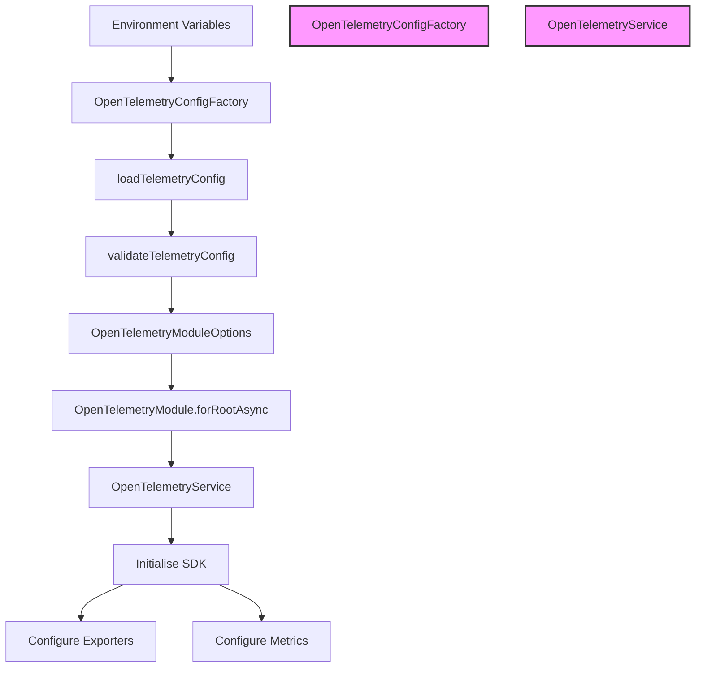

# Architecture Diagram

> **Document Information**  
> Created by: Claude 3 Opus (Anthropic)  
> Date: 19/07/2025  
> Version: 1.1  
> AI/LLM Details: This document was created using Claude 3 Opus by Anthropic (version 2023-08-22)

## System Architecture

The following diagram illustrates the high-level architecture of the NestJS OpenTelemetry POC application:

## Component Interactions

The diagram shows the following key components and their interactions:

1. **Client Request**: External requests to the API endpoints.

2. **NestJS HTTP Server**: The core NestJS server that handles incoming HTTP requests.

3. **Metrics Interceptor**: A global interceptor that captures metrics for all API requests, including timing, status codes, and request parameters.

4. **API Controllers**: The controllers that handle specific API endpoints for products, orders, health, and metrics.

5. **Services**: Business logic services that implement the application functionality.

6. **Repositories**: Data access layer that simulates database operations.

7. **Error Metrics Filter**: A global exception filter that captures and records metrics for all errors.

8. **OpenTelemetry Module**: A custom NestJS module that provides OpenTelemetry integration:
   - **OpenTelemetry Service**: Core service that initialises and manages the OpenTelemetry SDK.
   - **Metrics Service**: Service that provides a simplified API for creating and recording metrics.
   - **Business Metrics Service**: Service that provides domain-specific metrics for business operations.
   - **HTTP Instrumentation**: Automatic instrumentation for HTTP requests and responses.

9. **Exporters**: Components that export metrics to different destinations:
   - **Console Exporter**: Exports metrics to the console for debugging.
   - **Prometheus Exporter**: Exports metrics in Prometheus format via an HTTP endpoint.
   - **OTLP HTTP Exporter**: Exports metrics using the OpenTelemetry Protocol over HTTP.

10. **Prometheus Server**: External Prometheus server that scrapes metrics from the application.

11. **Grafana**: External Grafana instance that visualises metrics from Prometheus.

## Data Flow

1. A client sends an HTTP request to the NestJS application.
2. The request passes through the Metrics Interceptor, which records the start time.
3. The request is routed to the appropriate controller and handler.
4. The handler calls the necessary services and repositories to process the request.
5. During processing, business metrics are recorded using the Business Metrics Service.
6. The response is generated and passed back through the Metrics Interceptor.
7. The Metrics Interceptor records the end time and calculates the request duration.
8. The Metrics Interceptor records API metrics using the Metrics Service.
9. If an error occurs, the Error Metrics Filter captures it and records error metrics.
10. The OpenTelemetry Service periodically exports all collected metrics via the configured exporters.
11. External systems like Prometheus and Grafana can access and visualise the exported metrics.

## Configuration Flow

This configuration flow shows how the application loads and validates configuration from environment variables, then uses it to initialise the OpenTelemetry SDK and configure exporters and metrics.