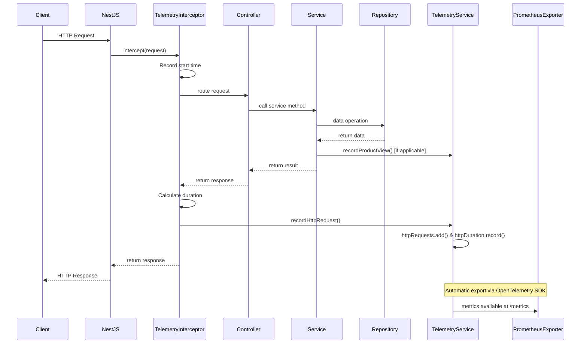
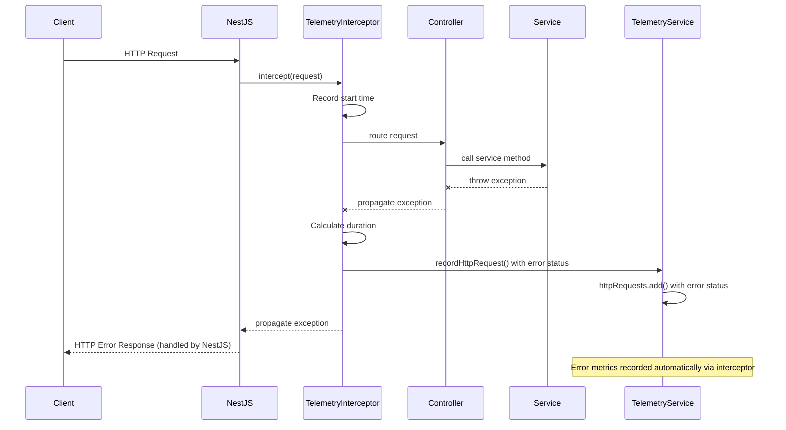
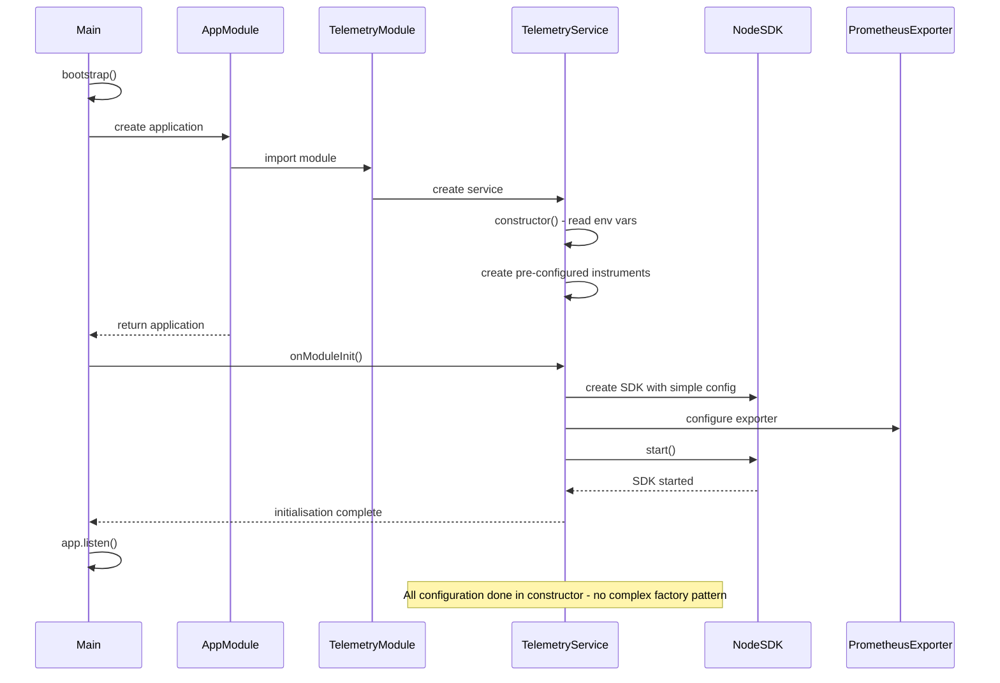
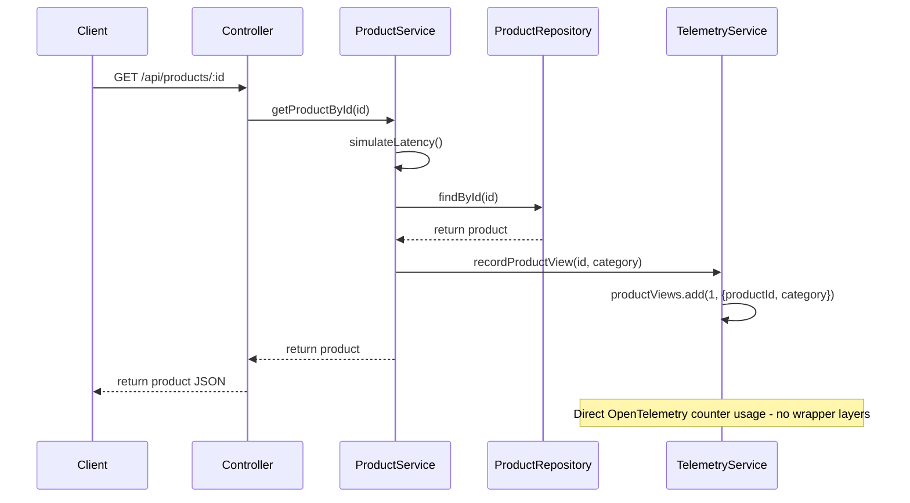
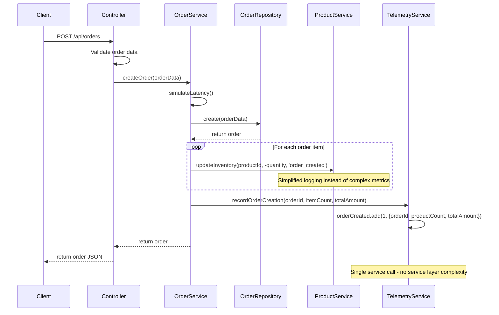
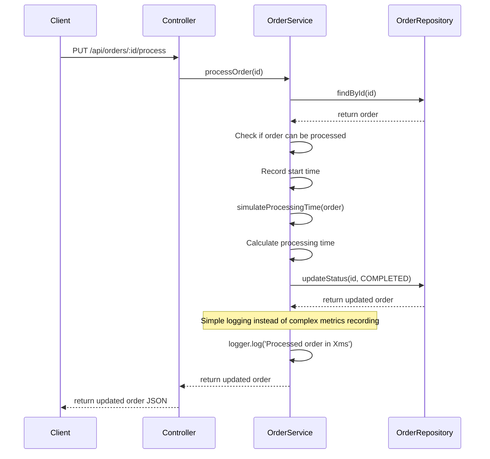

# Sequence Diagrams

> **Document Information**  
> Created by: Claude 3 Opus (Anthropic), Updated by: Claude 3.5 Sonnet (Anthropic)  
> Date: 19/07/2025  
> Version: 2.0  
> AI/LLM Details: Originally created using Claude 3 Opus, updated after refactoring by Claude 3.5 Sonnet (claude-3-5-sonnet-20241022)

## Refactoring Notice

**Important**: These sequence diagrams have been updated to reflect the simplified architecture documented in [`../40_REFACTOR.md`](../40_REFACTOR.md). The original complex service interactions have been streamlined.

This document contains sequence diagrams for key operations in the refactored NestJS OpenTelemetry POC application.

## Simplified API Request Flow with Metrics Recording

The following diagram illustrates the simplified flow of an API request through the refactored application:

## Simplified Error Handling Flow

The following diagram illustrates the simplified error handling in the refactored application:

## Simplified OpenTelemetry Initialisation Flow

The following diagram illustrates the simplified OpenTelemetry SDK initialisation:

## Simplified Product View Flow with Business Metrics

The following diagram illustrates the simplified product view flow:

## Simplified Order Creation Flow with Business Metrics

The following diagram illustrates the simplified order creation flow:

## Simplified Order Processing Flow

The following diagram illustrates the simplified order processing flow:

## Key Changes in Sequence Diagrams

The refactored sequence diagrams show significant simplifications:

1. **Single Service**: `TelemetryService` replaces `OpenTelemetryService`, `MetricsService`, and `BusinessMetricsService`
2. **Direct API Usage**: Metrics are recorded directly using OpenTelemetry instruments
3. **Simplified Error Handling**: Errors are handled through the interceptor rather than a separate filter
4. **Reduced Complexity**: Fewer service calls and simpler interaction patterns
5. **Focus on Core Metrics**: Only essential business metrics are recorded

These changes result in:

- **Faster execution** due to fewer service layer calls
- **Easier debugging** with simpler call stacks
- **Better maintainability** with clearer interaction patterns
- **Reduced overhead** from eliminated wrapper methods
