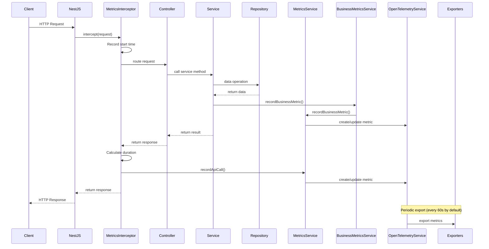
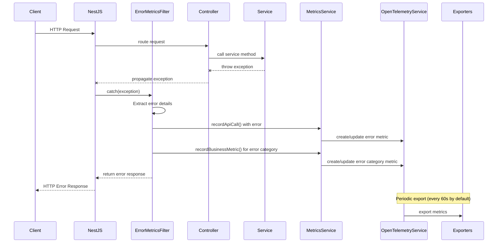
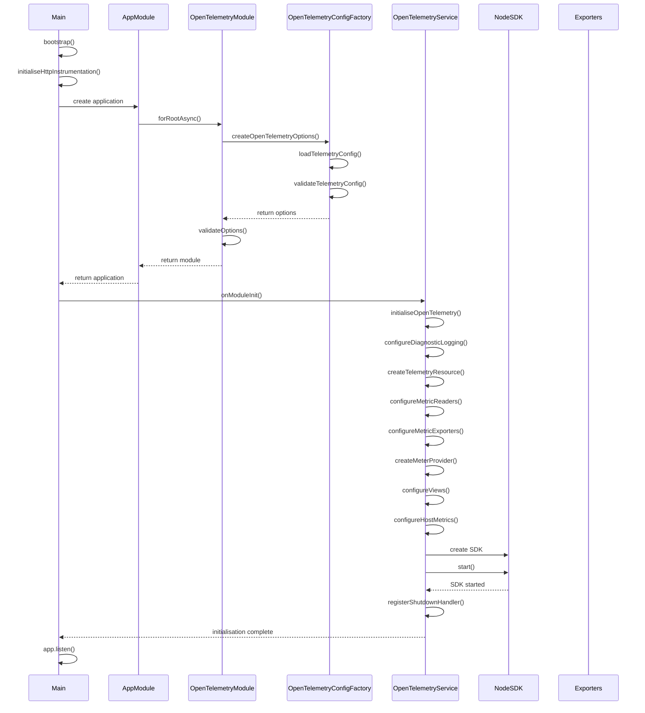
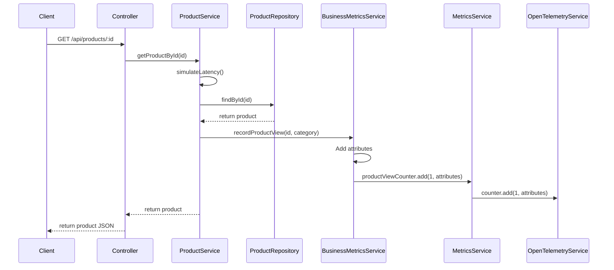
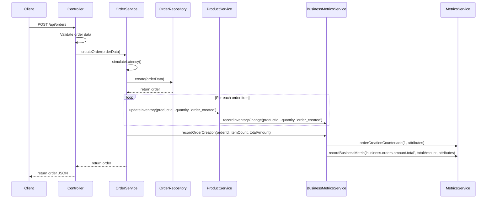
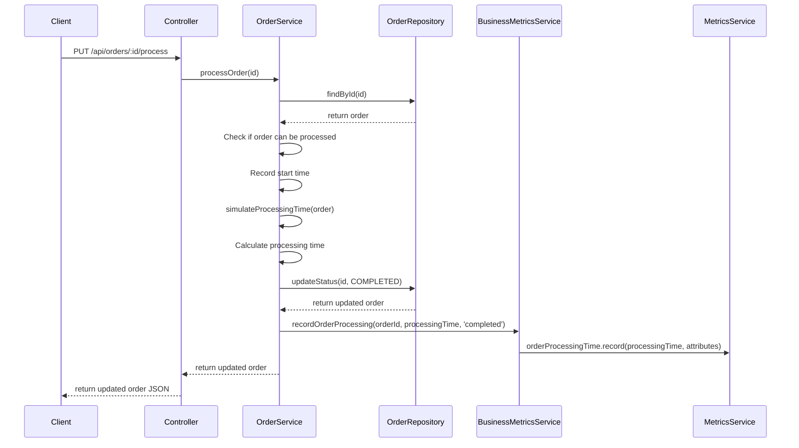

# Sequence Diagrams

> **Document Information**  
> Created by: Claude 3 Opus (Anthropic)  
> Date: 19/07/2025  
> Version: 1.1  
> AI/LLM Details: This document was created using Claude 3 Opus by Anthropic (version 2023-08-22)

This document contains sequence diagrams for key operations in the NestJS OpenTelemetry POC application.

## API Request Flow with Metrics Recording

The following diagram illustrates the flow of an API request through the application, including metrics recording:

## Error Handling Flow with Metrics Recording

The following diagram illustrates how errors are handled and recorded as metrics:

## OpenTelemetry Initialisation Flow

The following diagram illustrates how the OpenTelemetry SDK is initialised:

## Product View Flow with Business Metrics

The following diagram illustrates how a product view is processed and recorded as a business metric:

## Order Creation Flow with Business Metrics

The following diagram illustrates how an order is created and recorded as a business metric:

## Order Processing Flow with Business Metrics

The following diagram illustrates how an order is processed and the processing time is recorded as a business metric:

These sequence diagrams illustrate the key flows in the application, focusing on how metrics are recorded during normal operations and error handling.